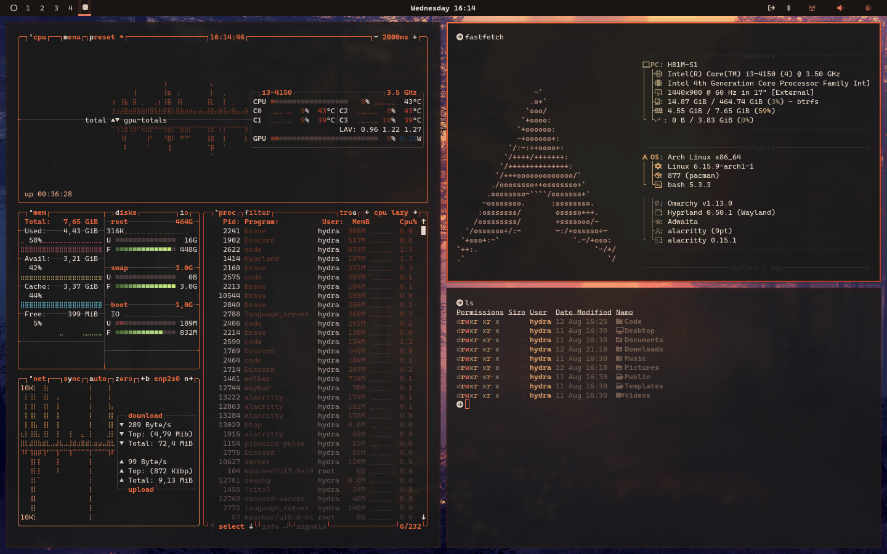

# Ember n Ash Theme

A warm, smoky aesthetic — deep charcoals and ashy grays kissed with soft ember light.
Designed for those who want their desktop to feel like glowing coals in a fading hearth.



---

## Design Notes
- **Subtle warmth**: Low-saturation ember tones that never overpower
- **Smoky depth**: Dark grays with just a hint of brown for richness
- **Eyes at ease**: Muted contrast for long sessions without strain
- **One vision, everywhere**: Consistent palette across terminal, bar, lock screen, and notifications

---

## Color DNA

### Core Shades
| Purpose     | Hex       | Name                |
|-------------|-----------|---------------------|
| Background  | `#1a1a1a` | Deep Ash Charcoal    |
| Foreground  | `#e5d6c6` | Warm Ash Beige       |
| Secondary   | `#2a2a2a` | Smoked Iron          |

### Accents
| Role     | Hex       | Description              |
|----------|-----------|--------------------------|
| Primary  | `#ff884d` | Soft Ember Orange         |
| Secondary| `#d9a066` | Ashy Gold                 |
| Success  | `#9e8f70` | Muted Moss                |
| Warning  | `#e3b97f` | Burnished Amber           |
| Error    | `#d45d4c` | Smoldering Coal           |
| Info     | `#a98274` | Dusty Clay                |

---

## Terminal Palette

| Color    | Normal    | Bright    |
|----------|-----------|-----------|
| Black    | `#1a1a1a` | `#2a2a2a` |
| Red      | `#d45d4c` | `#e87461` |
| Green    | `#9e8f70` | `#b39c7c` |
| Yellow   | `#d9a066` | `#e3b97f` |
| Blue     | `#6c5b4c` | `#7f6b5d` |
| Magenta  | `#b57276` | `#c6898c` |
| Cyan     | `#a98274` | `#ba9486` |
| White    | `#d1c0b0` | `#f2e6d8` |

---

## What’s Themed
- **Alacritty** — smoky charcoal backdrop with warm ember accents
- **Hyprland** — ember gradient active borders
- **Waybar** — subtle warm indicators with gentle glow
- **Mako** — amber borders on notifications
- **Btop** — soft ember gradients that mimic fading coals
- **Neovim** — syntax colors tuned for a warm, muted vibe
- **Hyprlock** — dim charcoal lock screen with ember glow accents

---

## Install
To install this theme, use the `omarchy-theme-install` command:

```bash
omarchy-theme-install https://github.com/Hydradevx/omarchy-ember-n-ash-theme
````

---

## Wallpaper Ideas

* Minimalist dark gray with orange ember accents
* Photography of campfires or glowing charcoal
* Smoky mountains at dusk with warm light
* Abstract renders of fading coals

---

**Tip:** Works beautifully with a slight vignette and low-opacity blur for a soft, ember-lit atmosphere.
